# Ovpnsplit

Because NetworkManager can't read the new way of OpenVPN to create client config files.

This little tool will split the file.ovpn into 4 files (.ca.pem, .cert.pem, .key.pem, .tls-auth.pem) so you can directly link them in your NetworkManager configuration UI.


## How to use

Download your .ovpn file, then

```
ovpnsplit file.ovpn
```

and you should have

```
file.ovpn.ca.pem
file.ovpn.cert.pem
file.ovpn.key.pem
file.ovpn.tls-auth.pem
```

### Configure NetworkManager


Add a new network
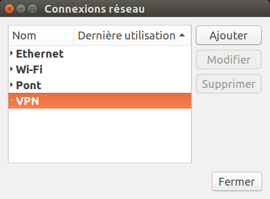

Import a .ovpn file
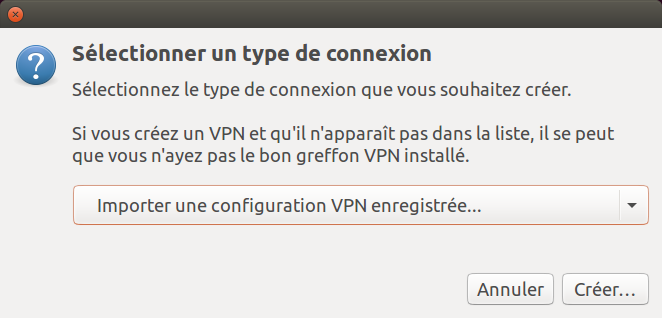

Select the file
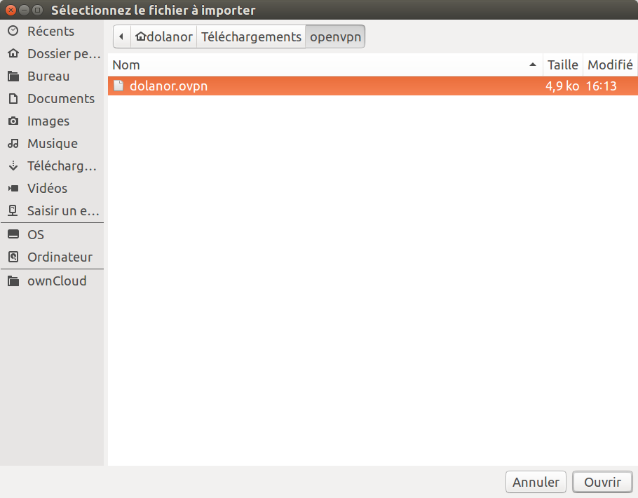

Choose a user cert file
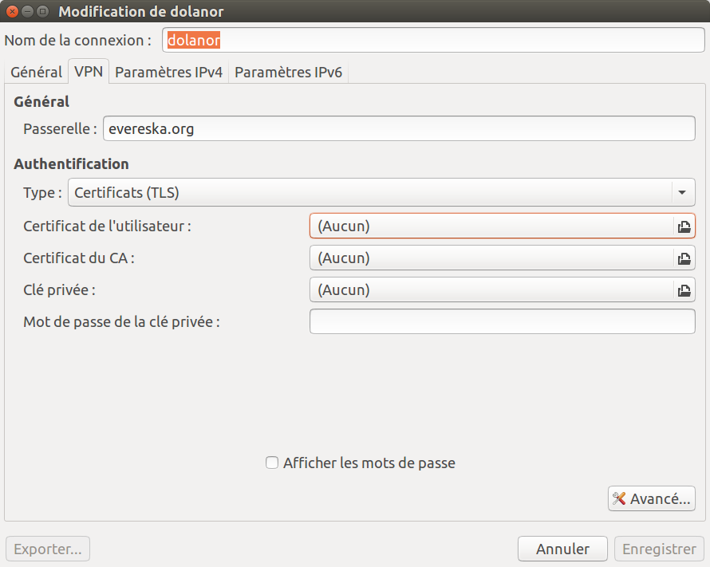

Select the file
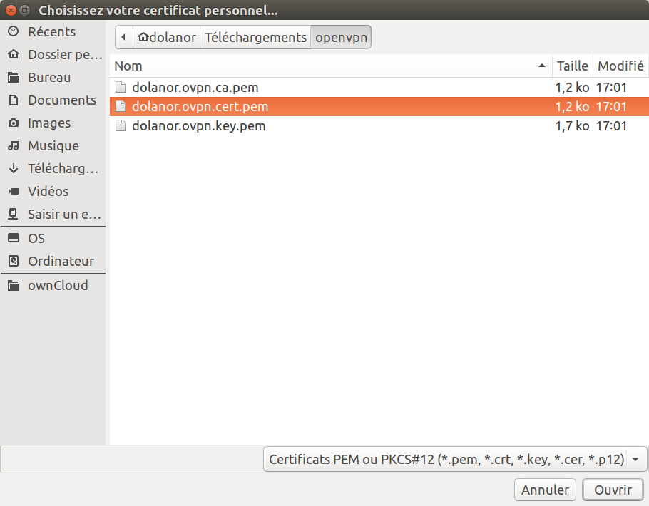

Choose a CA cert file
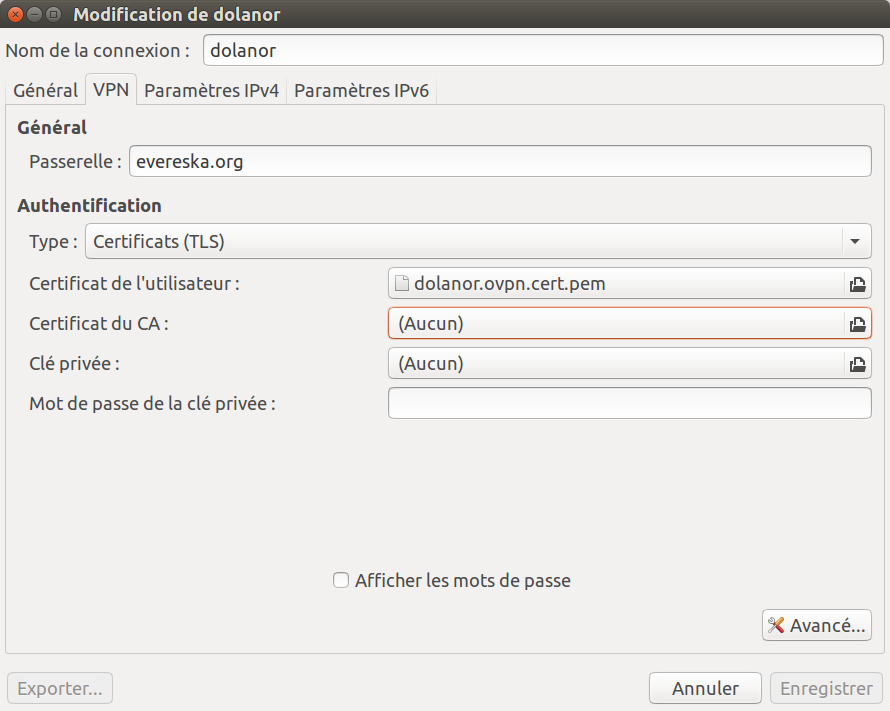

Select the file
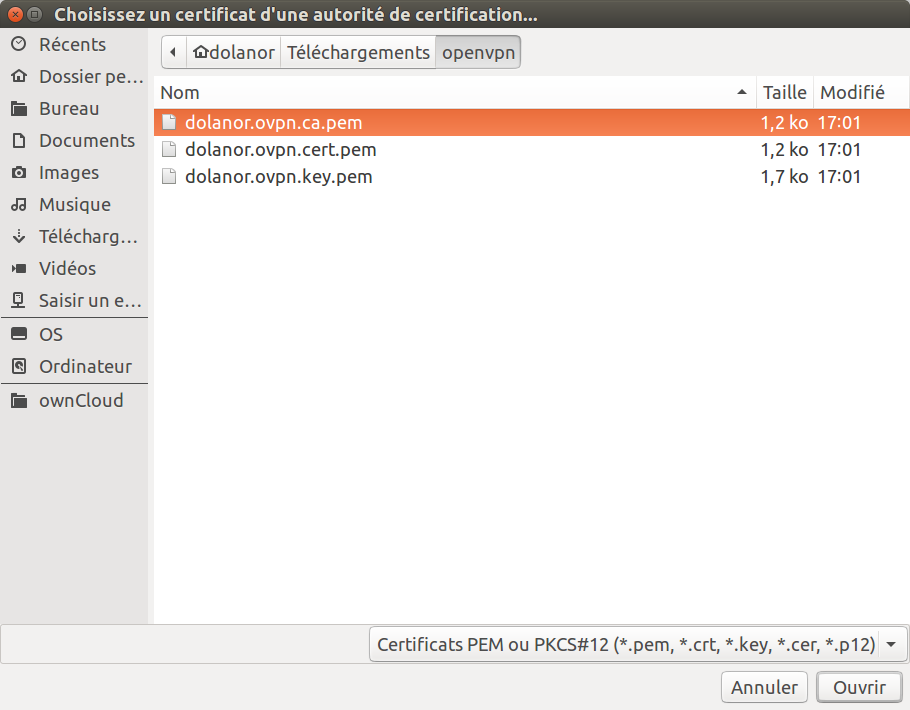

Choose a key file
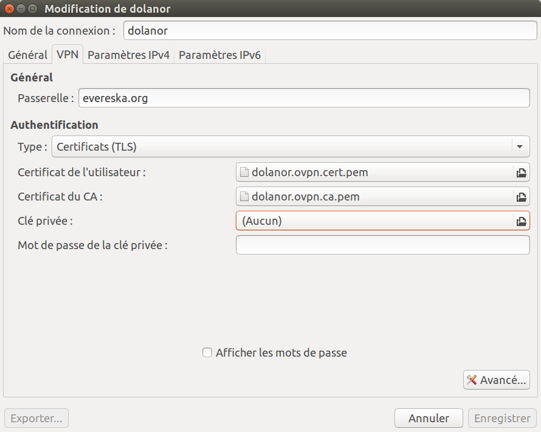

Select the file
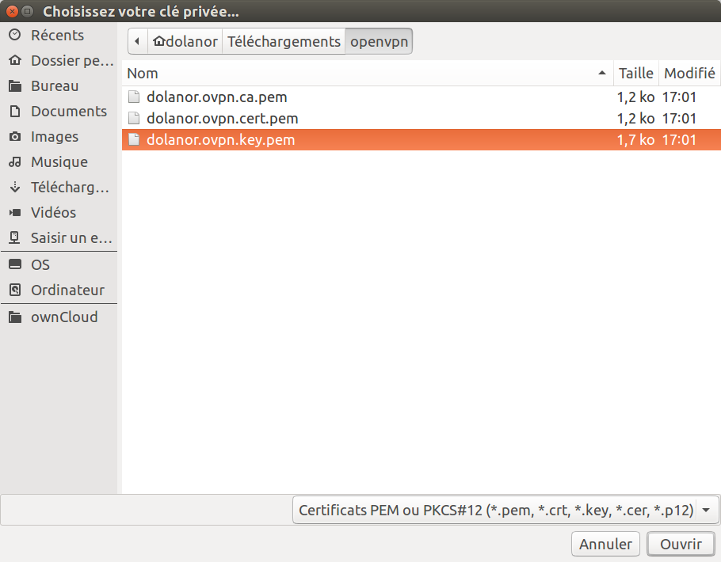

Open the advanced config panel
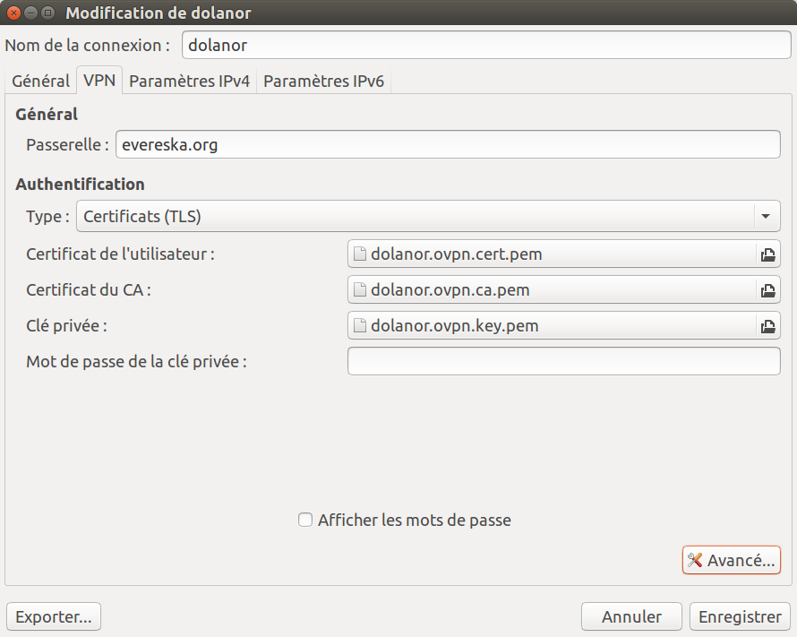

Go to TLS Auth Tab
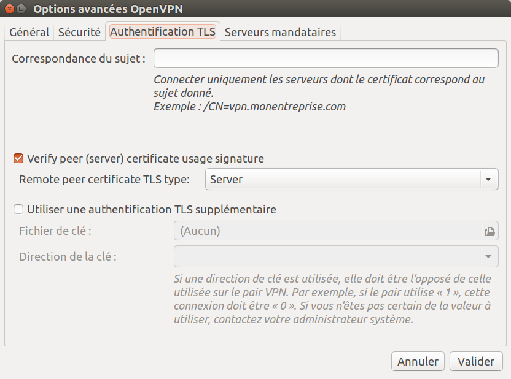

Add a optional TLS authentication
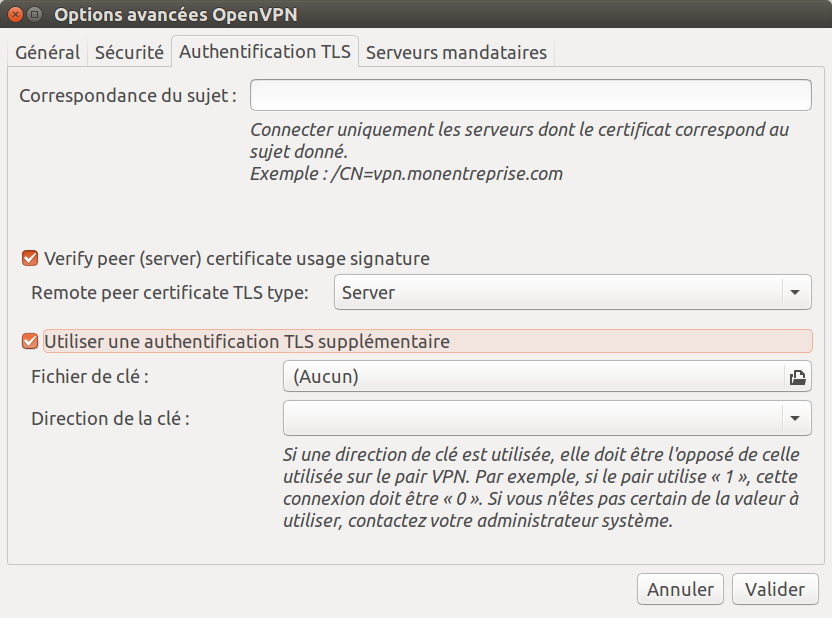

Choose a tls-auth file
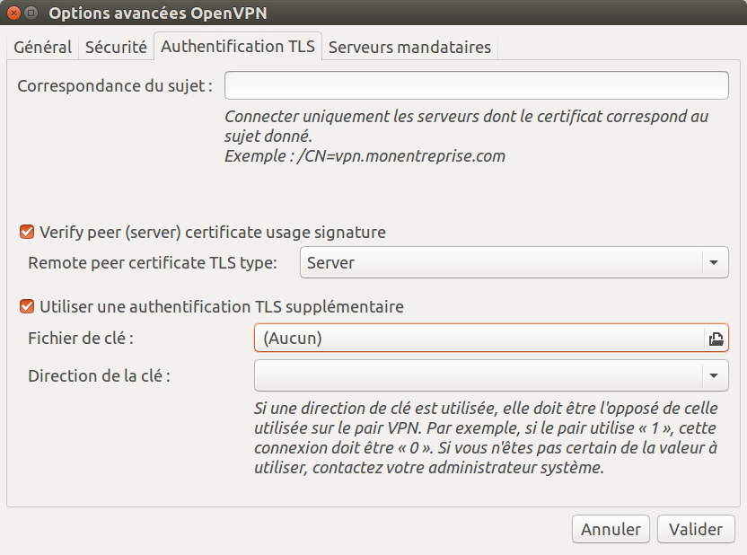

Select the file
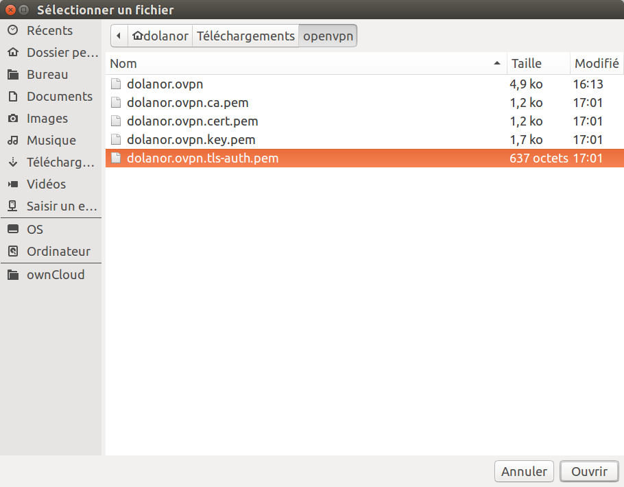

Set the key direction
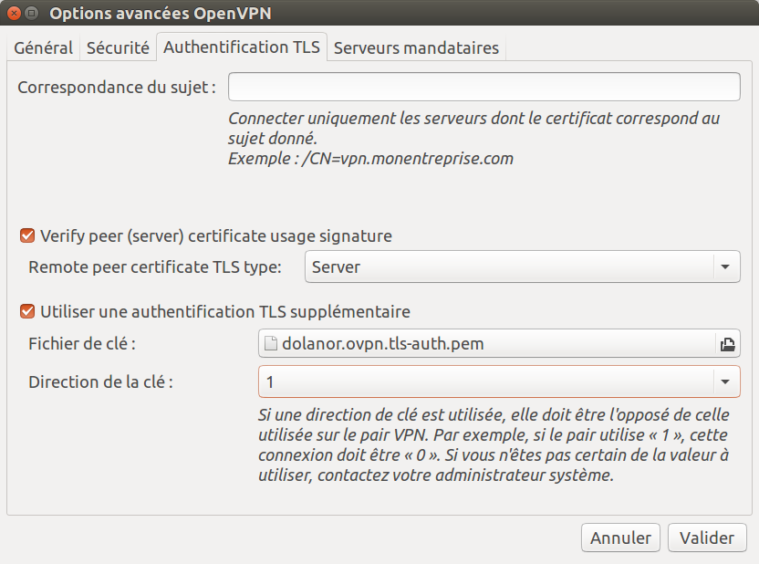

## Limitations

Right now, it is based on .ovpn files created by the [kylemanna/openvpn](https://hub.docker.com/r/kylemanna/openvpn) docker container, which handle tls-auth and stuff. Your .ovpn file might differ and you might not get all those files.
